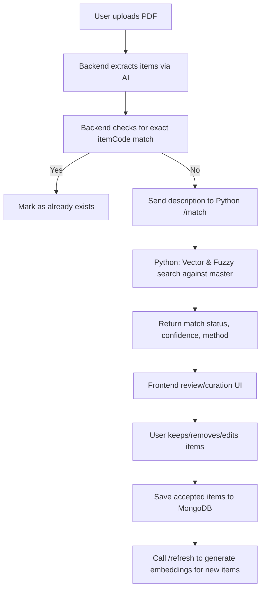

# AI-Powered Stock Master Matching System

## Overview
This project implements a robust, production-grade AI-powered entity matching and curation system for Stock Master data. It combines traditional fuzzy matching with state-of-the-art semantic vector search using deep learning embeddings, providing a three-layer intelligent matching workflow for extracting, matching, and curating product data from PDFs.

---

## Workflow Diagram



---

## Step-by-Step Process

1. **PDF Upload**
   - User uploads a PDF in the Stock Master tab.
   - The backend extracts table data using AI (OpenAI/Mistral) and returns a JSON array of items.

2. **Matching & Curation**
   - For each extracted item:
     - **Exact itemCode match:** If found in the master, mark as already exists.
     - **No itemCode match:**
       - Send the description to the Python microservice `/match` endpoint.
       - The Python service generates an embedding and compares it to all master embeddings (vector search).
       - If vector search is inconclusive, falls back to fuzzy string matching.
     - Returns match status (`matched`, `suggested`, `unmatched`, `already_exists`), confidence score, method, and matched master item (if any).
   - The frontend displays all this info in a review/curation modal, with Keep/Remove/Edit options for each item.

3. **Saving to Database**
   - Only items marked as "Keep" are saved to MongoDB.
   - After saving, the backend calls the Python `/refresh` endpoint to generate embeddings for new items.

---

## Technologies Used
- **Frontend:** React (StockMaster.js)
- **Backend:** Node.js (Express, Axios, Multer, pdf2table)
- **AI Extraction:** OpenAI/Mistral (via API)
- **Database:** MongoDB (stores master items and embeddings)
- **AI Matching Microservice:** Python (FastAPI, sentence-transformers, thefuzz, pymongo)

---

## Component Descriptions

### **Frontend (React)**
- Handles PDF upload, displays extracted items, and provides a curation UI.
- Shows match status, confidence, method, and matched master item for each extracted item.
- Lets user keep, remove, or edit items before saving.

### **Backend (Node.js/Express)**
- Receives PDF uploads, extracts tables using AI, and returns structured items.
- For each extracted item:
  - Checks for exact itemCode match in MongoDB.
  - If not found, calls the Python microservice for vector/fuzzy matching.
- Returns all match info to the frontend for curation.
- Saves only curated items to MongoDB and triggers embedding generation for new items.

### **Python AI Matching Microservice (FastAPI)**
- Loads all master items and their embeddings from MongoDB on startup and on `/refresh`.
- `/match` endpoint:
  - Accepts a list of descriptions.
  - For each, generates an embedding and performs vector search against master embeddings.
  - If vector search fails, falls back to fuzzy string matching.
  - Returns top matches, confidence scores, and method.
- `/refresh` endpoint:
  - Regenerates embeddings for all master items missing them.

---

## Matching Logic
- **Exact itemCode match:** Highest priority. If found, item is marked as already exists.
- **Vector similarity search:** Uses sentence-transformers to find semantically similar items. Confidence >80% = matched, 60–80% = suggested.
- **Fuzzy string matching:** Fallback for partial/typo matches. Confidence >80% = matched, 60–80% = suggested.
- **Unmatched:** No suitable match found.

---

## Embeddings
- Generated for all master items using sentence-transformers (MiniLM-L6-v2).
- Stored in MongoDB as an array field (`embedding`).
- Used for fast semantic search in the Python service.
- New items get embeddings after being saved and `/refresh` is called.

---

## Adding New Data & Curation
- Upload a new PDF and review extracted items in the curation modal.
- See match status, confidence, and method for each item.
- Keep, remove, or edit items as needed.
- Only accepted items are saved and embedded for future matching.

---

## How to Run the System
1. **Start MongoDB** (locally or via Atlas)
2. **Start the Python microservice:**
   ```bash
   cd python
   uvicorn ai_matcher_service:app --reload
   ```
3. **Start the Node.js backend:**
```bash
cd backend
npm install
npm run dev
```
4. **Start the React frontend:**
```bash
cd frontend
   npm install
npm start
```
5. **Upload PDFs and use the Stock Master tab for curation.**

---

## Extensibility & Best Practices
- The system can be extended to other document types (POs, invoices, etc.) using the same matching logic.
- You can add manual assignment, auto-refresh, or more advanced AI models as needed.
- Always review matches before saving to ensure data quality.

---

## Caveats
- Ensure the Python service is running and embeddings are up-to-date (call `/refresh` after adding new items).
- For very large catalogs, consider using a dedicated vector database (e.g., Pinecone, Weaviate) for even faster search.

---

## Authors & Contributors
- System design and implementation: You & your team
- AI/ML guidance: Your mentor/sir
- Code and documentation: AI assistant 